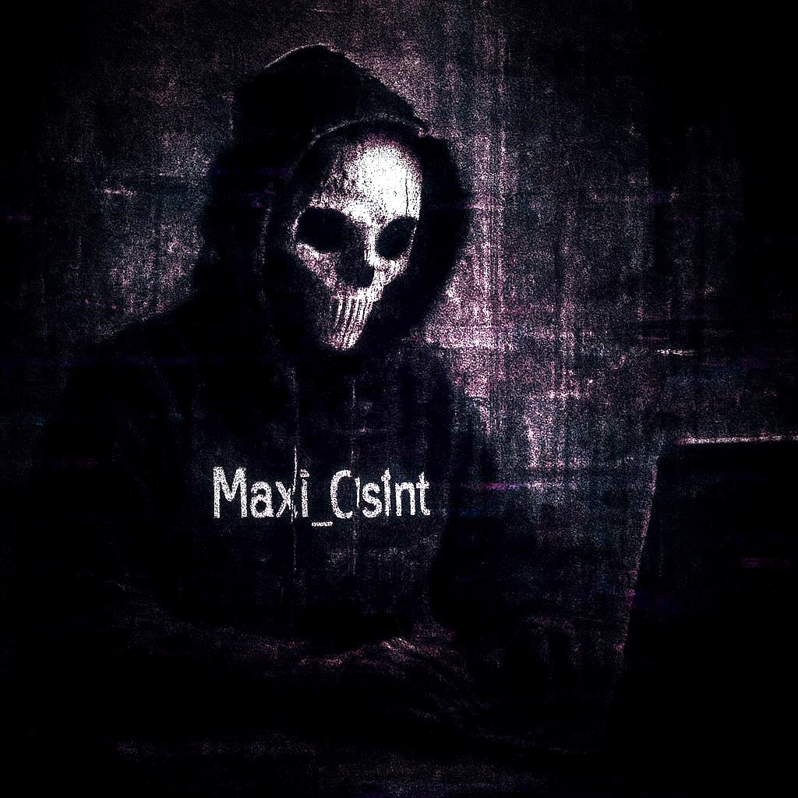

# osint-portfolio
My OSINT investigation cases, reports and data summaries (redacted)

  

<h1 align="center">OSINT Portfolio — Maxi_Os1nt</h1>

  Fragments from real investigations focused on fraud analysis, identity tracing, and high-confidence attribution.

 Case Summaries

 Cross-border Fraud — Crypto and False Documentation

Investigated individuals and entities behind a fake import/export scheme.  
Started with leaked receipts and progressed to crypto wallet tracing, shell domains, and full identity attribution.  
Total loss on the victim's side exceeded $120,000.

**Key elements:** linguistic profiling, export records, breach reuse, passive IP/DNS data.

 Telegram Impersonation and Document Forgery

Analyzed a social engineering fraud operation involving fake legal assistance via Telegram bots and PDF forgeries.  
Used document metadata, linked usernames, and payment trails to trace back to real-world identities and locations.

Key elements: bot enumeration, metadata extraction, wallet tracking, cross-platform correlation.

 Violent Incident and Ownership Attribution

Linked a fatal physical incident to a specific business by investigating public ownership data, hidden company affiliations, and social feedback contradictions.  
Public statements diverged significantly from internal structural data.

Key elements: corporate records, business registries, location-based social data, timeline analysis.

 Methodology and Tools

- Targeted Google queries (dorking)
- Telegram analytics (botnet patterns, account clusters)
- Breach correlation (email, phone, password reuse)
- Passive WHOIS/DNS history
- Entity resolution across aliases and platforms
- Custom-built Python CLI tools for OSINT and attribution
- All sessions logged via screenshots, hashes, and metadata

Contact

Due to the nature of investigations, this portfolio contains only redacted fragments.  
For collaboration, methodology discussion, or validation purposes, contact via pseudonym:  
@Maxi_Os1nt
